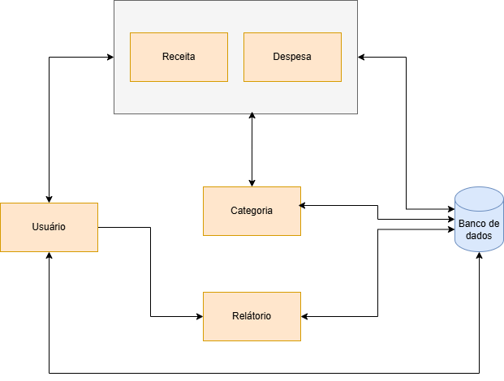

# 💰 **Projeto MoneyZada - Sistema de Organização Financeira**

O **MoneyZada** é um sistema de **gerenciamento de finanças pessoais**, criado para permitir que os usuários possam controlar suas **receitas**, **despesas**, e obter **relatórios financeiros**. O objetivo deste repositório é ser a parte do **back-end** do sistema, proporcionando uma API robusta e segura para a gestão financeira.

---

## 🚀 **Funcionalidades**

### Principais funcionalidades:
- **Cadastro de Receitas**: O usuário pode cadastrar suas fontes de receitas, com descrição, valor e categoria.
- **Cadastro de Despesas**: O usuário pode cadastrar suas despesas, com descrição, valor e categoria.
- **Gestão de Categorias**: O sistema permite ao usuário organizar suas receitas e despesas por categorias.
- **Despesas Recorrentes**: Despesas recorrentes podem ser cadastradas e o sistema irá adicioná-las automaticamente em intervalos definidos (ex: mensal).
- **Relatórios Financeiros**: O sistema gera relatórios financeiros baseados nas receitas e despesas cadastradas, permitindo visualizar o saldo, as receitas e as despesas por período e categoria.
- **Autenticação e Autorização**: Sistema de login seguro com JWT (JSON Web Token) para garantir que apenas usuários autenticados possam acessar suas finanças.

---

## 🛠️ **Tecnologias Utilizadas**

- **Java 17+**: Linguagem de programação principal.
- **Spring Boot**: Framework utilizado para desenvolvimento da aplicação backend.
- **Spring Security**: Para implementar autenticação e autorização de usuários.
- **JPA (Java Persistence API)**: Para interação com o banco de dados (PostgreSQL).
- **Swagger**: Para documentação da API.
- **PostgreSQL**: Banco de dados relacional utilizado para armazenar os dados das receitas, despesas, categorias e usuários.
- **Docker**: Para facilitar a execução do ambiente de desenvolvimento, incluindo o banco de dados e a aplicação.

---

## 🛠️ **Instruções de Uso**

### 1. **Clonando o Repositório**

```bash
git clone https://github.com/IuryAlmeidaDev/MoneyZada.git
cd MoneyZada
```

### 2. **Configuração do Ambiente com Docker**

Certifique-se de ter o **Docker** e o **Docker Compose** instalados.

Para rodar a aplicação e o banco de dados, basta executar o seguinte comando:

```bash
docker-compose up -d
```

Esse comando irá iniciar tanto a aplicação **Spring Boot** quanto o banco de dados **PostgreSQL** em containers separados. O Docker irá baixar as imagens necessárias e configurar os containers automaticamente.

### 3. **Acessando a Aplicação**

Após a execução do Docker Compose, a aplicação estará disponível em `http://localhost:8080`.

### 4. **Documentação da API (Swagger)**

A documentação da API está disponível através do **Swagger**. Após rodar a aplicação, você pode acessar a interface interativa do Swagger em:

```
http://localhost:8080/swagger-ui/
```

Aqui você encontrará todos os endpoints disponíveis e poderá interagir com a API diretamente.

---

## 🔒 **Segurança e Autenticação**

A autenticação é realizada utilizando o **Spring Security** com **JWT** (JSON Web Token). Após o login, o usuário receberá um token JWT, que deve ser incluído no cabeçalho das requisições subsequentes para acessar as funcionalidades protegidas.

---

## 💬 **Contribuindo**

1. Faça um fork do repositório.
2. Crie uma branch para a sua feature (`git checkout -b feature/nome-da-feature`).
3. Faça as alterações necessárias e adicione testes.
4. Envie um pull request com uma descrição clara sobre o que foi alterado.

---


### 📊 **Diagramas**

#### Arquitetura do Sistema


#### Diagrama de Fluxo do MoneyZada


## 👨‍💻 **Autor**

- **Iury Almeida** – Desenvolvedor Back-End | [GitHub](https://github.com/IuryAlmeidaDev)

---

### 🚧 **Licença**

MIT License

Copyright (c) 2025 Iury Almeida
